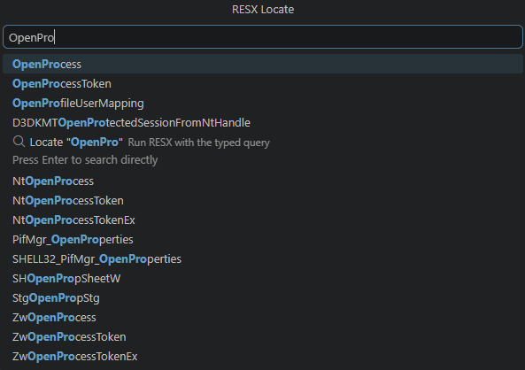

<h1 align="center">RESX</h1>
<p align="center"><b>Windows Binary Analysis & RE Toolkit</b></p>

<p align="center">
  
  
  
  
  <a href="https://titansoftwork.com">
    
  </a>
</p>

RESX is a Windows binary analysis toolkit for terminal-first reversing, symbol-backed inspection, targeted disassembly, pseudo-C reconstruction, CFG recovery, triage, and PE inspection.

## Documentation

- [CLI documentation](docs/cli.md)
- [VS Code extension documentation](docs/vscode-extension.md)

## Screenshots

### VS Code Binary Viewer


### Command Palette Workflows




## Install The VS Code Extension

See the full guide in [docs/vscode-extension.md](docs/vscode-extension.md).

Typical flow:

```powershell
cd resx-vscode
npm install
npm run compile
npm run package
```

Install the generated `.vsix` from VS Code with `Extensions: Install from VSIX...`.

## Use The CLI

See the full guide in [docs/cli.md](docs/cli.md).

Build:

```powershell
cargo build --release
```

Common commands:

```powershell
resx dump <dll> <function>
resx cfg <dll> <function>
resx intelli <dll> [function]
resx peinfo <dll>
resx locate <name>
resx locate-sym <name>
resx syms <dll>
```
