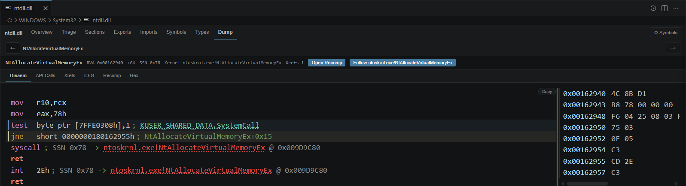

# RESX VS Code Extension

RESX Binary Viewer is the Visual Studio Code extension for inspecting Windows PE binaries with the `resx` analysis engine.

It opens `.exe`, `.dll`, and `.sys` files in a custom editor and provides an analysis workspace inside VS Code.

## Install

### Development Build

```powershell
cd resx-vscode
npm install
npm run compile
```

Launch an Extension Development Host with `F5`.

### Package A VSIX

```powershell
cd resx-vscode
npm run package
```

Install the generated `.vsix` from VS Code with `Extensions: Install from VSIX...`.

## Features

- PE overview, sections, exports, imports, symbols, types, triage, and dump views
- Disassembly, xrefs, CFG, recompilation, hex view, and nested API call trees
- Symbol and PDB controls, including explicit symbol path and PDB file settings
- Command palette entry points for `RESX: Locate`, `RESX: Locate Symbol`, and `RESX: Dump`
- Syscall stub annotations and direct follow-through into kernel targets, including Win32K GUI syscall paths
- `Dev` trace tab for `resx` command invocations, arguments, timing, and stderr/error output

## Command Palette

Use `RESX: Locate`, `RESX: Locate Symbol`, and `RESX: Dump`.

`RESX: Locate` resolves API or export lookups such as `NtOpenProcess`. `RESX: Locate Symbol` resolves symbol-oriented lookups such as `RtlpHeapHandleError`. `RESX: Dump` selects a module, loads exports plus PDB-backed symbols with progress, and opens the dump view for the selected target.

## Requirements

- Windows
- `resx.exe`

The extension resolves the analyzer in this order:

1. Bundled binary inside the extension package
2. `resx.executablePath` from user settings, only when `resx.allowCustomExecutable` is enabled

On Windows, the extension verifies the Authenticode signer before execution and validates the bundled binary against the trust manifest.

## Settings

- `resx.executablePath`
- `resx.allowCustomExecutable`
- `resx.loadSymbolsOnOpen`
- `resx.symbolPaths`
- `resx.pdbFile`

## Screenshots





## References

- [Repository README](../README.md)
- [CLI documentation](cli.md)
